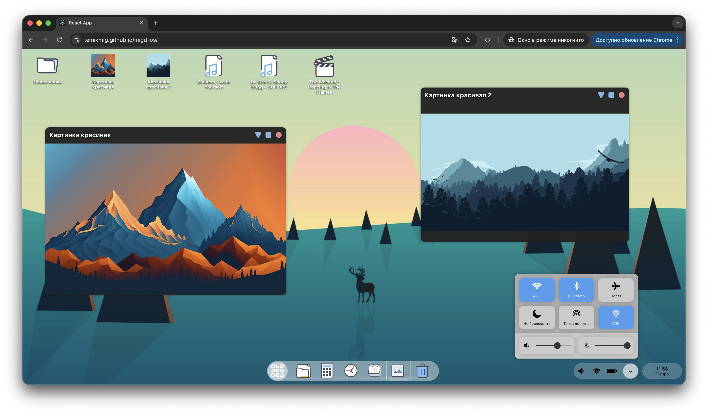
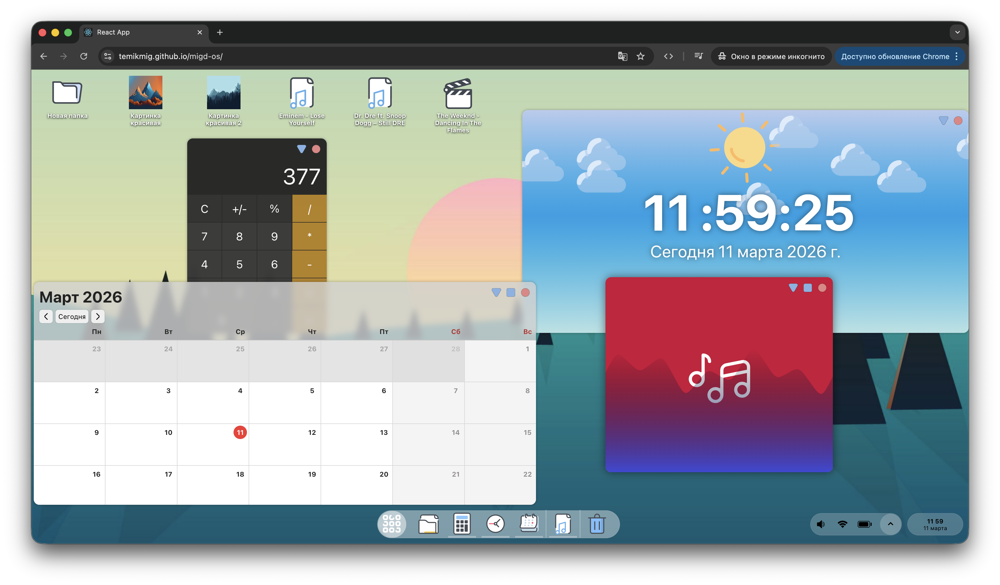
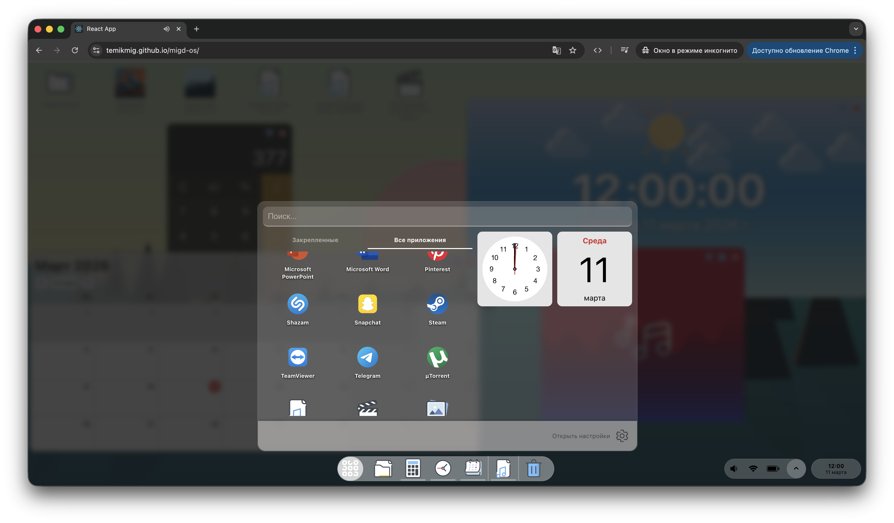
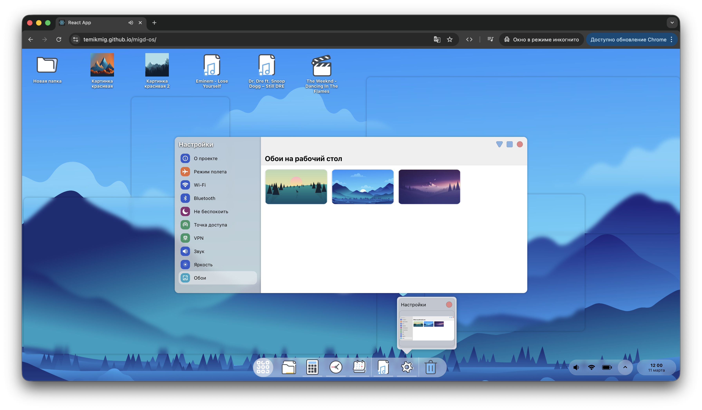

# migd-OS

**migd-OS** — это интерактивный симулятор операционной системы, созданный на **React.js**.  
Проект демонстрирует работу оконного интерфейса, многозадачности и пользовательских настроек прямо в браузере.

Попробовать онлайн:  
https://temikmig.github.io/migd-os/

---

## О проекте

Migd-OS — это экспериментальный интерфейс, который имитирует поведение классической операционной системы.  
Вы можете открывать окна, перемещать их, работать с несколькими приложениями одновременно и настраивать внешний вид интерфейса.

Проект создан как **pet-project для демонстрации frontend-архитектуры и работы UI-системы окон**.

---

## 🖥 Демонстрация

### Рабочий стол



### Множественные окна



### Стартовое меню



### Настройки



---

## Основные возможности

### Множественные окна

Работайте сразу с несколькими окнами — перемещайте, открывайте и переключайтесь между задачами, как в настоящей ОС.

### Настройки интерфейса

Меняйте внешний вид системы и настраивайте UI под себя.

### Интерактивный рабочий стол

Знакомая парадигма desktop-интерфейса прямо в браузере.

### Быстрая работа

Благодаря React приложение работает плавно и мгновенно реагирует на действия пользователя.

---

    

---

## Запуск проекта

```bash
git clone https://github.com/temikmig/migd-os
cd migd-os
npm install
npm start
```
